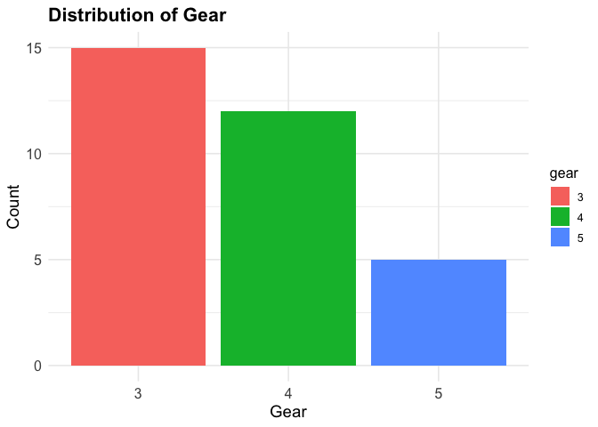

<!-- README.md is generated from README.Rmd. Please edit that file -->

# generate.barplot

<!-- badges: start -->

<!-- badges: end -->

The goal of generate.barplot is to create a bar plots for to visualize
the distribution of a categorical variable in a data frame. It ensures
the input dataset is valid and that the selected column is a factor
before plotting.

## Installation

You can install the development version of generate.barplot from
[GitHub](https://github.com/) with:

``` r
# install.packages("pak")
pak::pak("ZhouBrianna/generate.barplot")
```

## Usage

``` r
generate_barplot(dataset, x, x_name)
```

## Example

This is a basic example which shows you how to solve a common problem:

``` r
library(generate.barplot)
generate_barplot(dataset = mtcars, x = "gear", x_name = "Gear")
```



Notes - The `generate_barplot` function uses `ggplot2` for creating the
plot - If the dataset or column specified by `x` is invalid, the
function will stop with an error message.
